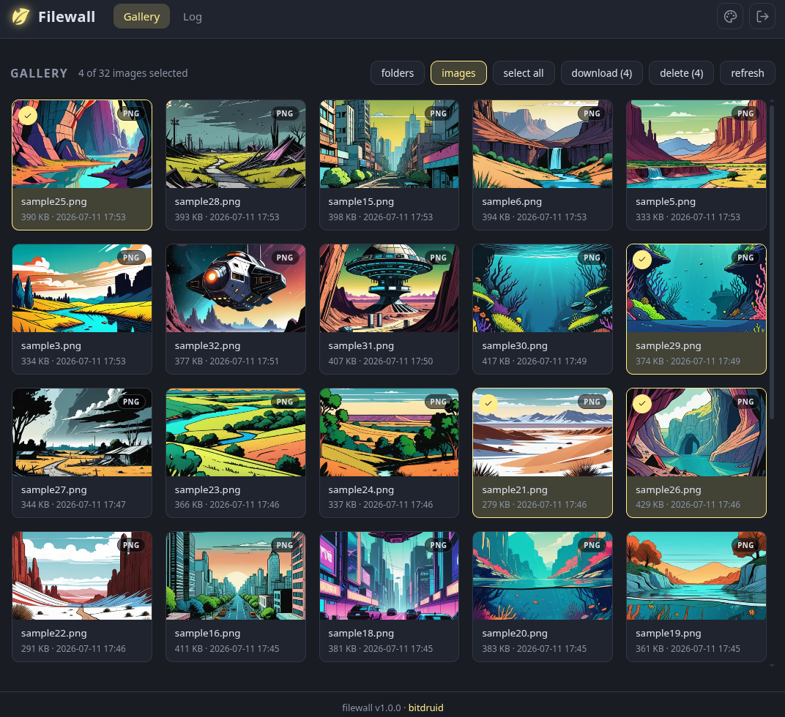

<div align="center">

# Filewall

Mini webapp for browsing a mounted folder

[](https://hub.docker.com/r/bitdruid/filewall)

<a href="example.png"></a>

</div>

# about

Filewall shows every file of a bind-mounted folder as a gallery of cards to browse, view and clean up a shared folder from any browser.

- one card per file with bare infos only: filename, size, modified date and a filetype badge
- image files render as cached webp thumbnail and open in a large lightbox view on click
- filter toggle: only image files (default) or all files
- folder toggle: browse the real folder structure instead of the flat gallery
- select one or multiple files (shift-click selects the whole range, or select all) and delete them
- download marked files: single file directly, multiple bundled as zip
- recursive listing, hidden files and folders are skipped
- light / dark / auto theme, accent and surface flavor switchers (persisted per browser, incl. favicon)
- view the application log in a dedicated tab (with level filtering)
- optional single-user login

# run

## docker

### get image

```bash
docker pull bitdruid/filewall:latest
```

```bash
docker buildx build -t bitdruid/filewall:latest . --load
```

### compose

```bash
docker-compose up -d
```

## script

```bash
bash start.sh [options]
```

Options:

- `-d, --data-dir PATH` - Folder shown in the gallery (default: `filewall/data/` inside the package)
- `-b, --base-path PATH` - Public base path when hosting under a subdirectory (example: `/subdir1/app`)
- `-u, --login-user USER` - Enable login with this username
- `-w, --login-pw PW` - Password for the login user
- `-t, --login-timeout MIN` - Session idle timeout in minutes (default: 60)
- `--help` - Show help message

## cli

- requires Python >= 3.13

```bash
pipx install .
# or: uv tool install .

filewall
```

Options:

- `--host HOST` - Interface to bind the server to (default: 0.0.0.0)
- `--port PORT` - Port for the server (default: 5000)
- `--data-dir PATH` - Folder shown in the gallery (default: `data/` inside the package)
- `--base-path PATH` - Public base path when hosting under a subdirectory (example: `/subdir1/app`)
- `--login-user USER` - Enable login with this username (requires `--login-pw`)
- `--login-pw PW` - Password for the login user (requires `--login-user`)
- `--login-timeout MIN` - Session idle timeout in minutes (default: 60)
- `--reload` - Auto-reload on code changes (development only)

## envs

Table for envs:

| Variable        | Default                        | Description                                                                                 |
| --------------- | ------------------------------ | ------------------------------------------------------------------------------------------- |
| `DATA_DIR`      | `data/` inside the package     | Folder shown in the gallery                                                                 |
| `BASE_PATH`     | _(empty)_                      | Public base path when hosting under a subdirectory (example: `/subdir1/app`)                |
| `LOG_LEVEL`     | `DEBUG`                        | `DEBUG`, `INFO`, `WARNING`, `ERROR`, or `CRITICAL`                                          |
| `INSTANCE_DIR`  | `instance/` inside the package | Directory for instance data (log file + thumbnail cache)                                    |
| `LOGIN`         | `false`                        | Set to `true` to require login with `LOGIN_USER` / `LOGIN_PW`. Sessions are in-memory only. |
| `LOGIN_USER`    | _(empty)_                      | Username for the login                                                                      |
| `LOGIN_PW`      | _(empty)_                      | Password for the login                                                                      |
| `LOGIN_TIMEOUT` | `60`                           | Session idle timeout in minutes                                                             |

## volumes

Table for volumes:

| Volume                              | Description                                            |
| ----------------------------------- | ------------------------------------------------------ |
| `/path/to/your/folder:/data`        | the browsed folder (deletions in the UI are permanent) |
| `./instance:/app/filewall/instance` | rotating application log + webp thumbnail cache        |

---

> **Disclaimer:** fully agentic project — built entirely by AI against the [druidforms](https://github.com/creepytree/druidforms) design framework (see [AGENTS.md](AGENTS.md)).
